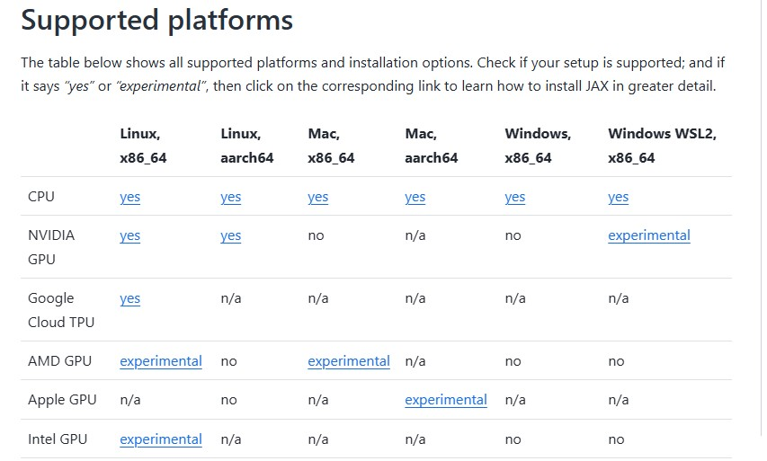

# 解説対象

本記事では、jaxの環境構築方法として、nvidia-GPU版のwindows上（WSL2上）での環境構築方法を解説します。

## CPU版/GPU版

cpu版のインストールは簡単だが、GPU版は少し難しい様子。しかもwindowsへの対応は2025/1/19現在は公式サイト上で「experimental」となっている。
うまく動くか試してみた。
- https://jax.readthedocs.io/en/latest/installation.html

