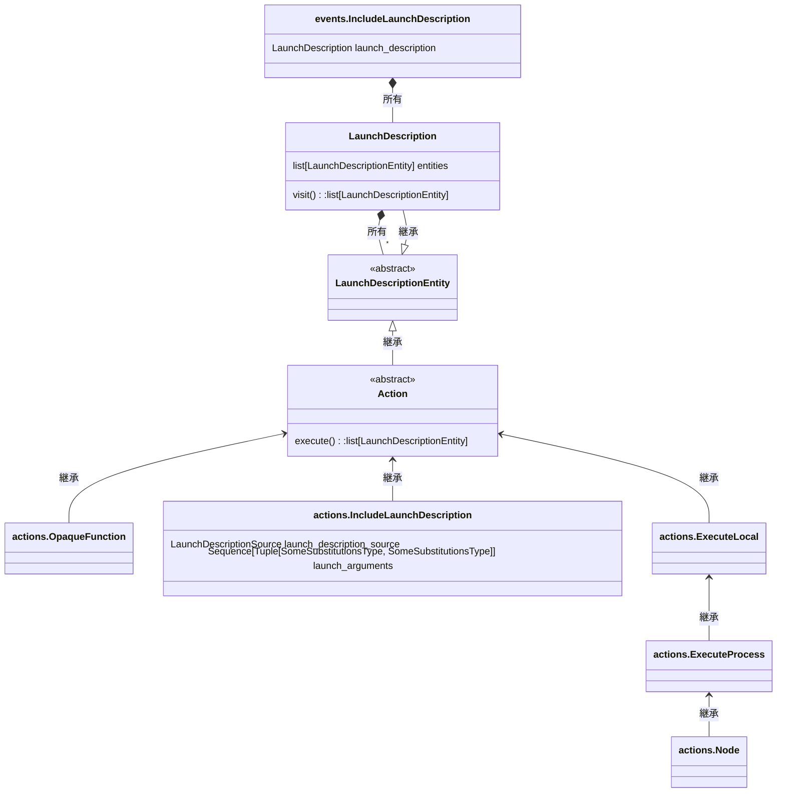

# 解説対象

本記事では、ROS2のlaunch機能の基本構造について解説します。launch機能は、多数のnodeを組み合わせて実現しているロボットシステムを簡単に起動できるようにするための仕組みです。launch機能を使用せずにnodeを起動するようなスクリプト（bashスクリプト等）を書くことでも同等のことは可能ですが、launch機能を使用する方が圧倒的に簡単でありかつ可読性が高い（使う側も嬉しい）ので、必ずlaunch機能を使用したロボットシステムの起動ができるようにlaunchファイルを用意するようにしましょう。

本記事は下記の「ROS2を深く理解する」の記事群の一部ですが、この記事単独でも理解できるようになっています。

https://zenn.dev/uedake/articles/ros2_collection

# 前提
- ROS2 humble時の実装に基づいています。
- launchファイルの記述は、python形式・xml形式・yaml形式の３形式のどれでも可能ですが、本記事はpython形式を例に解説しています。
  - ただし、xml形式・yaml形式で記載したlaunchファイルは、loaderによってpy形式のlaunchファイル相当に翻訳されて実行される為、本記事で記載している処理はpython形式・xml形式・yaml形式の３形式共通です
  - なお、launchファイルは特段の理由ない限りpython形式で書くべきです。シンプルな構成であればどの形式でも記述可能ですが、複雑なことをする場合xml形式・yaml形式では行き詰まります。最初は良くてもプロジェクトの進展によって後から複雑なことをしたくなるのが常ですので、launchファイルは最初からpython形式で書き始めることを推奨します

# 前提知識

- launchの概念
  - launchファイル中に、やりたい処理（＝アクション）をやりたい順序で記載する。アクションの中で最も基本的なものは、nodeを動かす為のexecutableを起動するアクション（Nodeアクション/LifecycleNodeアクション）
  - launchファイルは、cliから`ros2 launch`コマンドで実行することができる
  - launchファイルを実行すると、記述されているアクションが順に実行される

# 公式ドキュメント

- TBD

# ソースの確認

以下では、launchfileに記載したアクションがどのように実行されるのかについて、アクションの「読み込みフェーズ」と「実行フェーズ」という概念を理解することを目標とします。記述は実際にソースを読み込んで行く過程を示していますので、必ずしも見通しのよい記述にはなっていません。こういう風にソースを追っていくのかという参考としてみてください。結論だけ知りたい人は飛ばして「まとめ」を見てもらったほうが理解はしやすいです。

なおlaunch機能はpythonで記述されており、型ヒントもついているので読みやすいコードです。深く理解したい人は自分でもソースを追ってみるとよいです。

## ros2 launchコマンド（=`LaunchCommand`）を理解する

まずは、`ros2 launch`コマンドを実行したときに何が行われるか理解しましょう。

`ros2 launch`を実行した場合のソースはどこにあるのでしょうか？ros2のcliコマンド(`ros2 node`とか`ros2 topic`とか)の実装箇所を探すには、`ros2cli.command`という語でソースコードを検索すればよいです。cliの各コマンドが実行された際にどのクラスが実行されるのかの定義（setup.py上で行われている）を見つけることができます。実際にソースコードを検索してみると`ros2 launch`を実行した場合は、`ros2launch.command.launch:LaunchCommand`が実行されることがわかります。

[ros2launch/setup.py](https://github.com/ros2/launch_ros/blob/humble/ros2launch/setup.py)
```py:ros2launch/setup.py
entry_points={
    'ros2cli.command': [
        'launch = ros2launch.command.launch:LaunchCommand',
    ],
}
```

実際に`LaunchCommand`クラスの実装を見てみましょう

- 見るべきは`main()`メソッドです。`ros2`コマンド実行時に対応するクラスの`main()`メソッドが実行されます
  - 実際のコードではlaunchファイルへのpathの与え方の違いでmode分岐していますが、以下では最もよく使用する pkg file modeの場合のコードを抜粋します
    - pkg file modeは、packageに含まれるlaunchファイルを実行する方法です。※その他に、package外のlaunchファイルを実行するmodeがあります
  - `main()`メソッドは、pathを解決した上で`launch_a_launch_file()`を呼び出しているだけです

[ros2launch/command/launch.py](https://github.com/ros2/launch_ros/blob/humble/ros2launch/ros2launch/command/launch.py)

```py:ros2launch/command/launch.py抜粋
class LaunchCommand(CommandExtension):
    """Run a launch file."""
    # 略

    def main(self, *, parser, args):
        """Entry point for CLI program."""
        # 略
        launch_arguments = []        
        # 略
        path = get_share_file_path_from_package(
            package_name=args.package_name,
            file_name=args.launch_file_name)
        launch_arguments.extend(args.launch_arguments)
        # 略
        return launch_a_launch_file(
            launch_file_path=path,
            launch_file_arguments=launch_arguments,
            noninteractive=args.noninteractive,
            args=args,
            option_extensions=self._option_extensions,
            debug=args.debug
        )
```

次に`launch_a_launch_file()`を見てみましょう。

- 処理の骨子は下記であることがわかります
  1. `LaunchService`を生成する
      - ソースは`launch_service = launch.LaunchService(`　の箇所
  2. `IncludeLaunchDescription`アクションを唯一の要素とする`LaunchDescription`を作成し、その`LaunchDescription`を実行するイベントをセットする
      - ソースは`launch_service.include_launch_description(launch_description)`　の箇所
      - この`IncludeLaunchDescription`アクションは、`launch_a_launch_file`の引数として与えられる「launch fileへのpath」と「launch引数」をもとにlaunchファイルを読み込むというアクションです
  3. `LaunchService`を実行する
      - ソースは`launch_service.run()`　の箇所

[ros2launch/api/api.py](https://github.com/ros2/launch_ros/blob/humble/ros2launch/ros2launch/api/api.py)

```py:ros2launch/api/api.py抜粋
def launch_a_launch_file(
    *,
    launch_file_path,
    launch_file_arguments,
    noninteractive=False,
    args=None,
    option_extensions={},
    debug=False
):
    """Launch a given launch file (by path) and pass it the given launch file arguments."""
    for name in sorted(option_extensions.keys()):
        option_extensions[name].prestart(args)

    # If 'launch-prefix' launch file argument is also provided in the user input,
    # the 'launch-prefix' option is applied since the last duplicate argument is used
    if args and args.launch_prefix:
        launch_file_arguments.append(f'launch-prefix:={args.launch_prefix}')

    if args and args.launch_prefix_filter:
        launch_file_arguments.append(f'launch-prefix-filter:={args.launch_prefix_filter}')

    launch_service = launch.LaunchService(
        argv=launch_file_arguments,
        noninteractive=noninteractive,
        debug=debug)

    parsed_launch_arguments = parse_launch_arguments(launch_file_arguments)
    # Include the user provided launch file using IncludeLaunchDescription so that the
    # location of the current launch file is set.
    launch_description = launch.LaunchDescription([
        launch.actions.IncludeLaunchDescription(
            launch.launch_description_sources.AnyLaunchDescriptionSource(
                launch_file_path
            ),
            launch_arguments=parsed_launch_arguments,
        ),
    ])
    for name in sorted(option_extensions.keys()):
        result = option_extensions[name].prelaunch(
            launch_description,
            args
        )
        launch_description = result[0]
    launch_service.include_launch_description(launch_description)
    ret = launch_service.run()
    for name in sorted(option_extensions.keys()):
        option_extensions[name].postlaunch(ret, args)
    return ret
```

## LaunchServiceを理解する

次に`LaunchService`を見てみましょう。

- `LaunchService`のアーキテクチャの肝は、イベントキューとイベントハンドラリスト（注：実体はlistでなくdequeですが、概念的にはリストのように使用されているので便宜上リストと呼びます）です
  - イベントキューとは、イベントが処理すべき順に積まれたキューです。実体は`LaunchService`が管理する`LaunchContext`のインスタンス変数`_event_queue`にあります
    - イベントとは、launchサービスにおける処理の実行単位であり、アクション（launchファイルで定義した処理）と対応します。１アクション（の実行）が１イベントに対応する場合もあれば、１アクション（の実行）が複数のイベントへと対応する場合もあります。
    - イベントとして用意されているのは、下記6つです
      - `OnIncludeLaunchDescription`イベント
      - `OnExecutionComplete`イベント
      - `OnProcessStart`イベント
      - `OnProcessIO`イベント
      - `OnProcessExit`イベント
      - `OnShutdown`イベント
  - イベントハンドラリストとは、イベントを処理するための関数のリストです。実体は`LaunchService`が管理する`LaunchContext`のインスタンス変数`_event_handlers`にあります
- `LaunchService`のコンストラクタが実行されると、イベントハンドラリストに２つのイベントハンドラが登録されます（下記にコード引用）
  - `OnIncludeLaunchDescription`ハンドラ
  - `OnShutdown`ハンドラ
- `LaunchService`の`include_launch_description()`が実行されると、イベントキューに`IncludeLaunchDescription`イベントが追加されます。
- 非常に混乱しやすくて注意なのが、`IncludeLaunchDescription`という名前のクラスは、「アクション」と「イベント」の両方が存在すること
  - [launch.actions.IncludeLaunchDescription](https://github.com/ros2/launch/blob/humble/launch/launch/actions/include_launch_description.py)
    - `launch_a_launch_file()`メソッド内で生成される
  - [launch.events.IncludeLaunchDescription](https://github.com/ros2/launch/blob/humble/launch/launch/events/include_launch_description.py)
    - `LaunchService`の`include_launch_description()`メソッド内で生成される
    - プロパティとして`launch_description`（`LaunchDescription`型）をもつ
    - この`LaunchDescription`は`IncludeLaunchDescription`アクションをもつ
- `launch_service.run()`が実行されると、launch処理のloopが開始されイベントキューに積まれたイベントを１つ１つ順番に実行していきます（よくあるloop処理なのでコード省略）
  - イベントを１つ１つ順番に実行しているのが`_process_one_event()`メソッドであり、実体はそこから呼ばれる`__process_event()`メソッドです（下記にコード引用）
  - 実行すべきイベントを実行可能なイベントハンドラをイベントハンドラリストから見つけ、そのイベントハンドラの`handle()`メソッドの第一引数にイベントを渡すことによってイベント実行します
  - イベント実行の戻り値として`handle()`メソッドは、アクション（もしくは`LaunchDescription`）を返します
    - ソースでは`LaunchDescriptionEntity`クラスが戻り値と定義されていますが、`LaunchDescriptionEntity`クラスを継承しているクラスがアクション（もしくは`LaunchDescription`）です
  - アクション（もしくは`LaunchDescription`）が`visit_all_entities_and_collect_futures()`に渡されて実行されます

[launch_service.py](https://github.com/ros2/launch/blob/humble/launch/launch/launch_service.py)

```py:launch_service.py抜粋
class LaunchService:
    """Service that manages the event loop and runtime for launched system."""
    
    def __init__(
        self,
        *,
        argv: Optional[Iterable[Text]] = None,
        noninteractive: bool = False,
        debug: bool = False
    ) -> None:
        """
        Create a LaunchService.

        :param: argv stored in the context for access by the entities, None results in []
        :param: noninteractive if True (not default), this service will assume it has
            no terminal associated e.g. it is being executed from a non interactive script
        :param: debug if True (not default), asyncio the logger are seutp for debug
        """
        # Setup logging and debugging.
        launch.logging.launch_config.level = logging.DEBUG if debug else logging.INFO
        self.__debug = debug
        self.__argv = argv if argv is not None else []

        # Setup logging
        self.__logger = launch.logging.get_logger('launch')

        # Setup context and register a built-in event handler for bootstrapping.
        self.__context = LaunchContext(argv=self.__argv, noninteractive=noninteractive)
        self.__context.register_event_handler(OnIncludeLaunchDescription())
        self.__context.register_event_handler(OnShutdown(on_shutdown=self.__on_shutdown))

　　    # 略

    def emit_event(self, event: Event) -> None:
        """
        Emit an event synchronously and thread-safely.

        If the LaunchService is not running, the event is queued until it is.
        """
        future = None
        with self.__loop_from_run_thread_lock:
            if self.__loop_from_run_thread is not None:
                # loop is in use, asynchronously emit the event
                future = asyncio.run_coroutine_threadsafe(
                    self.__context.emit_event(event),
                    self.__loop_from_run_thread
                )
            else:
                # loop is not in use, synchronously emit the event, and it will be processed later
                self.__context.emit_event_sync(event)

        if future is not None:
            # Block until asynchronously emitted event is emitted by loop
            future.result()

    def include_launch_description(self, launch_description: LaunchDescription) -> None:
        """
        Evaluate a given LaunchDescription and visits all of its entities.

        This method is thread-safe.
        """
        self.emit_event(IncludeLaunchDescription(launch_description))

    # 略

    async def _process_one_event(self) -> None:
        next_event = await self.__context._event_queue.get()
        await self.__process_event(next_event)

    async def __process_event(self, event: Event) -> None:
        self.__logger.debug("processing event: '{}'".format(event))
        for event_handler in tuple(self.__context._event_handlers):
            if event_handler.matches(event):
                self.__logger.debug(
                    "processing event: '{}' ✓ '{}'".format(event, event_handler))
                self.__context._push_locals()
                entities = event_handler.handle(event, self.__context)
                entities = \
                    entities if isinstance(entities, collections.abc.Iterable) else (entities,)
                for entity in [e for e in entities if e is not None]:
                    from .utilities import is_a_subclass
                    if not is_a_subclass(entity, LaunchDescriptionEntity):
                        raise RuntimeError(
                            "expected a LaunchDescriptionEntity from event_handler, got '{}'"
                            .format(entity)
                        )
                    self._entity_future_pairs.extend(
                        visit_all_entities_and_collect_futures(entity, self.__context))
                self.__context._pop_locals()
            else:
                pass

```

## ros2 launchコマンド実行時に最初に実行されるイベント

- 最初にイベントキューに最初に存在するイベントは`IncludeLaunchDescription`イベント１つのみです
  - このイベントをハンドルできるのは、`OnIncludeLaunchDescription`ハンドラです。そのことは、`OnIncludeLaunchDescription`クラスのコンストラクタ中のmatcherが`lambda event: is_a_subclass(event, IncludeLaunchDescription)`となっていることからわかります。

[on_include_launch_description.py](https://github.com/ros2/launch/blob/humble/launch/launch/event_handlers/on_include_launch_description.py)

```py:on_include_launch_description.py抜粋
class OnIncludeLaunchDescription(EventHandler):
    """Event handler used to handle asynchronous requests to include LaunchDescriptions."""

    def __init__(self, **kwargs):
        """Create an OnIncludeLaunchDescription event handler."""
        from ..actions import OpaqueFunction
        super().__init__(
            matcher=lambda event: is_a_subclass(event, IncludeLaunchDescription),
            entities=OpaqueFunction(
                function=lambda context: [context.locals.event.launch_description]
            ),
            **kwargs,
        )
```

- 即ち、`LaunchService`の`run()`の中で始まるループ中で最初に実行されるイベント処理は、`OnIncludeLaunchDescription`の`handle()`メソッドです。
  - このメソッドは、`LaunchContext`のプロパティ`locals`(dict型)において、`locals.event`で`IncludeLaunchDescription`イベントが読めるようセットした後に、戻り値として`OpaqueFunction`アクションを返します（コード省略）
  - 戻り値として得られた上記`OpaqueFunction`アクションは、`visit_all_entities_and_collect_futures()`に渡されて実行されます
    - この`OpaqueFunction`アクションは、上記の`OnIncludeLaunchDescription`のコンストラクタ中で作成されている`OpaqueFunction(function=lambda context: [context.locals.event.launch_description])`であり、これは即ち、`IncludeLaunchDescription`イベントの`launch_description`変数（を唯一の要素とするリスト）を返す関数をアクションが実行(execute)されたときに呼び出すというアクションです。
    - この`launch_description`変数には、`IncludeLaunchDescription`アクションを唯一の要素とする`LaunchDescription`が入っています

[visit_all_entities_and_collect_futures_impl.py](https://github.com/ros2/launch/blob/humble/launch/launch/utilities/visit_all_entities_and_collect_futures_impl.py)

```py:visit_all_entities_and_collect_futures_impl.py抜粋
def visit_all_entities_and_collect_futures(
    entity: LaunchDescriptionEntity,
    context: LaunchContext
) -> List[Tuple[LaunchDescriptionEntity, asyncio.Future]]:
    """
    Visit given entity, as well as all sub-entities, and collect any futures.

    Sub-entities are visited recursively and depth-first.
    The future is collected from each entity (unless it returns None) before
    continuing on to more sub-entities.

    This function may call itself to traverse the sub-entities recursively.
    """
    sub_entities = entity.visit(context)
    entity_future = entity.get_asyncio_future()
    futures_to_return = []
    if entity_future is not None:
        futures_to_return.append((entity, entity_future))
    if sub_entities is not None:
        for sub_entity in sub_entities:
            futures_to_return += visit_all_entities_and_collect_futures(sub_entity, context)
    return [future_pair for future_pair in futures_to_return if future_pair[1] is not None]
```

## `visit_all_entities_and_collect_futures()`を理解する

`visit_all_entities_and_collect_futures()`メソッドでは、引数で渡されるアクション（もしくは`LaunchDescription`）を再帰的に実行していることがわかります。この点は「まとめ」に記載しています。

[`visit_all_entities_and_collect_futures_impl.py`](https://github.com/ros2/launch/blob/humble/launch/launch/utilities/visit_all_entities_and_collect_futures_impl.py)

```py:visit_all_entities_and_collect_futures_impl.py抜粋
def visit_all_entities_and_collect_futures(
    entity: LaunchDescriptionEntity,
    context: LaunchContext
) -> List[Tuple[LaunchDescriptionEntity, asyncio.Future]]:
    """
    Visit given entity, as well as all sub-entities, and collect any futures.

    Sub-entities are visited recursively and depth-first.
    The future is collected from each entity (unless it returns None) before
    continuing on to more sub-entities.

    This function may call itself to traverse the sub-entities recursively.
    """
    sub_entities = entity.visit(context)
    entity_future = entity.get_asyncio_future()
    futures_to_return = []
    if entity_future is not None:
        futures_to_return.append((entity, entity_future))
    if sub_entities is not None:
        for sub_entity in sub_entities:
            futures_to_return += visit_all_entities_and_collect_futures(sub_entity, context)
    return [future_pair for future_pair in futures_to_return if future_pair[1] is not None]
```

visit()メソッドが個々のアクションの実行を担っています

## アクションの実行を理解する

上記で流れが見えてきました。整理してみると、launchファイル中に記述したアクションが実行されるまでには２つのフェーズがあることがわかります。

1. 読み込みフェーズ
    - launchファイル中の`generate_launch_description()`メソッドが実行されるタイミングのこと
    - これは、`ros2 launch`によって作成された`IncludeLaunchDescription`アクションが実行された時に発生します
    - その他、あるlaunchファイルに記述されている`IncludeLaunchDescription`アクションが実行された結果として別のlaunchファイルが実行された時にも発生します
2. 実行フェーズ
    - 実行の順番が来たアクション（これは上位の`IncludeLaunchDescription`アクションから見ればサブアクション）の`visit()`が呼ばれるタイミングのこと
    - `visit()`では、アクション起動条件を満たしているかのチェックがされた上で`execute()`メソッドが呼ばれる

- [action.py](https://github.com/ros2/launch/blob/humble/launch/launch/action.py)の`visit()`メソッドを見ればアクションの実行フェーズの処理がわかります
- `visit()`では「アクション起動条件チェック」をしてから「アクションの実行」をしています
- アクション実行フェーズの処理
  1. アクション起動条件チェック
      - アクションをコンストラクトするときに渡せる引数`condition`が「アクション起動条件」となっており、`visit()`中でアクション起動条件を評価した結果によりアクションを起動するか抑制するか分岐しています
  2. アクションの実行
      - 各アクション毎の`execute()`メソッドを実行しています

[action.py](https://github.com/ros2/launch/blob/humble/launch/launch/action.py)

```py:action.py
class Action(LaunchDescriptionEntity):
    """
    LaunchDescriptionEntity that represents a user intention to do something.

    The action describes the intention to do something, but also can be
    executed given a :class:`launch.LaunchContext` at runtime.
    """

    def __init__(self, *, condition: Optional[Condition] = None) -> None:
        self.__condition = condition

    # 略

    @property
    def condition(self) -> Optional[Condition]:
        """Getter for condition."""
        return self.__condition

    # 略

    def visit(self, context: LaunchContext) -> Optional[List[LaunchDescriptionEntity]]:
        """Override visit from LaunchDescriptionEntity so that it executes."""
        if self.__condition is None or self.__condition.evaluate(context):
            try:
                return self.execute(context)
            finally:
                from .events import ExecutionComplete  # noqa
                event = ExecutionComplete(action=self)
                if context.would_handle_event(event):
                    future = self.get_asyncio_future()
                    if future is not None:
                        future.add_done_callback(
                            lambda _: context.emit_event_sync(event)
                        )
                    else:
                        context.emit_event_sync(event)
        return None
```

以上で全体の流れが掴めました

# まとめ

- launchの仕組みの本質は「アクションの再帰実行」です
    - ROSにおけるアクションという語は２つの異なる意味があるので注意です。node間の通信の１種であるアクション、launchファイル中で記載する処理であるアクション、の２つの異なる意味があります。本記事では後者のアクションを指しています

- アクションは「読み込みフェーズ」と「実行フェーズ」の２段階のタイミングで処理されます
  - 読み込みフェーズとは、
    - launchファイル中の`generate_launch_description()`メソッドが実行されるタイミングのこと
    - この段階ではアクションは処理待ちキューに入るだけで実行されません
  - 実行フェーズとは
    - 実行の順番が来たアクションの`visit()`が呼ばれるタイミングのこと
    - `visit()`はアクションの起動条件が満たされていれば個々のアクションの`execute()`を呼びます
    - アクションの`execute()`メソッドは戻り値としてアクション（もしくは`LaunchDescription`）のリストを返すことができます。この戻り値をサブアクションと呼びます
    - サブアクションも順に実行されていきます。これが「アクションの再帰実行」です

`ros2 launch`コマンドを実行した時に行われる処理をまとめると下記になります。

1. `ros2 launch`コマンドの実行
    - `ros2 launch`コマンドを実行すると、下記2の`IncludeLaunchDescription`イベントが生成される
2. `IncludeLaunchDescription`イベントの実行（handle）
    - `LaunchService`の処理loop（`LaunchService`の`run()`で始まるloop）中で実行される
        - `IncludeLaunchDescription`イベントは`OnIncludeLaunchDescription`ハンドラによって実行される
    - この`IncludeLaunchDescription`イベントが実行されると、生成した下記3の`OpaqueFunction`アクション※１を引数にして`visit_all_entities_and_collect_futures()`メソッドを呼び出すことで「アクションの再帰実行」（下記3～7）が開始される
3. `OpaqueFunction`アクション※１の実行（visit+execute）
    - この`OpaqueFunction`アクション※１が実行されると、下記4の`LaunchDescription`※２をサブアクションとして返す
4. `LaunchDescription`※２の実行（visit）
    - この`LaunchDescription`※２が実行されると、下記5の`IncludeLaunchDescription`アクション※３をサブアクションとして返す
5. `IncludeLaunchDescription`アクション※３の実行（visit+execute）
    - この`IncludeLaunchDescription`アクションは、引数として指定されている`AnyLaunchDescriptionSource`のメソッド`get_launch_description()`が呼ばれた時に、`ros2 launch`コマンドで指定されたpathにあるlaunchファイルをモジュールとして読み取り、そのモジュールの`generate_launch_description()`を実行した戻り値を返します
6. `LaunchDescription`※２の実行（visit）
    - この`LaunchDescription`※２は、ユーザが作成したlaunchファイルの`generate_launch_description()`メソッドの戻り値
    - `generate_launch_description()`メソッドの戻り値がサブアクションとなる
7. ユーザー定義アクションの実行（visit+execute）
    - ユーザが作成したlaunchファイルの`generate_launch_description()`メソッド中で定義したアクションが実行される
    - 例えば、ユーザが定義したNodeアクション等が実行されることになる

※１：`OpaqueFunction`アクションは、アクションが実行された時に「コンストラクト時に引数で設定されたpython関数」を実行してその結果を戻り値として返すアクション。「コンストラクト時に引数で設定されたpython関数」がアクション（もしくは`LaunchDescription`）のリストを返せば、それらはサブアクションとみなされ再帰的に実行されていく
※２：`LaunchDescription`は、自身が保持するアクション（もしくは`LaunchDescription`）のリストをサブアクションとして返します
※３：`IncludeLaunchDescription`アクションは、アクション実行時に「`SetLaunchConfiguration`アクション及びコンストラクト時に引数として渡された`LaunchDescriptionSource`の`get_launch_description()`の結果を返す」アクション

- launchの基本構造の理解の要は、上記2の[`visit_all_entities_and_collect_futures()`メソッド](https://github.com/ros2/launch/blob/humble/launch/launch/utilities/visit_all_entities_and_collect_futures_impl.py)です
  - 行っていることは引数で渡される「アクションもしくは`LaunchDescription`」を再帰的に実行すること
  - `visit_all_entities_and_collect_futures()`メソッドはアクションを実行した戻り値であるリストの要素数が1以上であれば、リスト中の要素をサブアクションとして順に`visit_all_entities_and_collect_futures()`メソッドに渡して実行します。これによってアクションが返すサブアクションが連鎖的に実行されていきます。これが「アクションを再帰的に実行する」ということです。

登場したクラスたちの関係を示すクラス図は下記になります



launchの基本構造の解説は以上です。具体的にどんなアクションが用意されているか？sustitutionとは何か？といった話題は別の記事で記載します。

https://zenn.dev/uedake/articles/ros2_launch2_substitution
https://zenn.dev/uedake/articles/ros2_launch3_configulation
https://zenn.dev/uedake/articles/ros2_launch4_node

## 参考：launchファイルで記載したアクションの処理の流れの詳細

### 読み込みフェーズ

1. launchファイルの`generate_launch_description()`メソッドの実行
    - これは、上位の`IncludeLaunchDescription`アクションが実行されることで始まります。`IncludeLaunchDescription`アクションの実行は、`ros2 launch`コマンドの実行もしくは他のlaunchファイル中で定義されている`IncludeLaunchDescription`アクションが実行されることで発生します
    - `generate_launch_description()`メソッドの中で定義しているアクションについて、アクションへの引数として（substitutionでない）通常の変数を使用していた場合、このタイミングで値は確定してしまいます
2. アクションが処理待ちキューに追加される
    - `generate_launch_description()`の戻り値（`LaunchDescription`クラス）に設定されている全てのアクションが実行待ちになります
      - このアクションは、`IncludeLaunchDescription`アクションから見た「サブアクション」にあたります。サブアクションという用語は、何かのアクションの結果生成されるアクションという意味です
    - アクションは「アクションを再帰的に実行する仕組み」の中で順次実行されるまで処理を待ちます。大切なのは、アクションは決して並列実行されることなく、シーケンシャルに１つ１つ実行されるということです

### 実行フェーズ
1. アクション起動条件チェック
    - 「アクション起動条件」の評価結果によって、アクションを起動するか抑制するか分岐します
    - アクション起動条件(`IfCondition`、`UnlessCondition`、`LaunchConfigurationEquals`、`LaunchConfigurationNotEquals`のいずれか)は、アクションをコンストラクトするときに渡せる引数`condition`に設定できます
    - アクション起動条件を作成する際に条件として指定できるのは「文字列」か「substitution」のどちらかです
      - 文字列はstr型で`1`、`0`、`true`、`false`（大文字小文字は問わない）のいずれかである必要があります
        - ただし、文字列を設定して条件分岐する方法は、積極的に使用する意味は一切ありません
          - python形式のlaunchファイルにおいては、pythonとしての通常のif分で条件分岐をしてアクションの追加・非追加を判定しても同じことができます
          - xml形式・yaml形式のlaunchファイルにおいては、文字列を固定値で与えることになる（アクションの実行・非実行はlaunchファイルを記載したタイミングで確定する）が、アクションを記述するしないで同等のことができる為
    - 意味のある使い方としては、アクション起動条件はsubstitutionを使用して設定することになります
    - substitutionの内容がアクション起動条件チェックを実施するタイミングで評価され、その値に応じてアクションを実行すべきか分岐します。なお、この評価結果は、文字列化したときに、`1`、`0`、`true`、`false`（大文字小文字は問わない）のいずれかである必要があります
2. アクションの実行
    - 各アクション毎の`execute()`メソッドによってアクションが実行されます
    - アクション実行において、アクションをコンストラクトした時の引数を使用するかはアクション毎に異なりますが、そのような引数があるアクションでは、substitutionを引数にいれておくことで、`execute()`メソッドが実行されたタイミングでsubstitutionが評価され値が決まります
