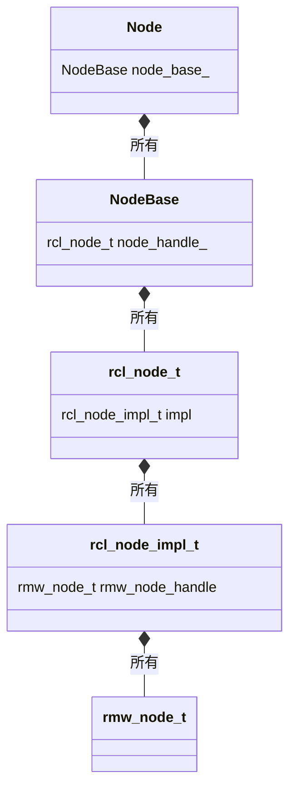

# 解説対象

:::message
この記事はROS初心者向けではなく、一通りの概念は理解したのでステップアップしたいという人向けです。
:::

本記事では、ROS2の中核概念であるノードの中身の基本構造について解説します。ノードにまつわる諸機能がどの部分で実装されているかを知っていると、コードリーディングが捗ります。

本記事の目標は、下記のノード内部構造を理解することです

- ノード
  - ROS2上で実行する処理を担う最も基本的なオブジェクト（論理処理単位）
  - `Node`クラス・`LifecycleNode`クラス及びそれらの派生クラス（c++やpython等の各クライアント言語で表現される）をインスタンス化して生成される
- rclノード
  - ノードの内部構造でありremapの処理など基本機能を提供している部分
  - クライアント言語（c++,python等）に依存しないcで実装されている
- rmwノード
  - rclノードの内部構造でありDDSという通信規格を用いてノード間で互いに通信を行えるようにする機能を提供している部分
  - クライアント言語（c++,python等）に依存しないcで実装されている

本記事は下記の「ROS2を深く理解する」の記事群の一部ですが、この記事単独でも理解できるようになっています。

https://zenn.dev/uedake/articles/ros2_collection

## 読むと役に立つと思われる読者
- ROS2を使用したロボット開発を始めて数か月ぐらい、ROS2の主要な概念についてはおおざっぱには理解しておりステップアップしたい方
- チュートリアル通りにやれば確かに動くけど・・・、自分は不適切な/冗長なコード書いているのでは？と自信がない方
- ROS2が期待通りに動いてくれない！ドキュメント読んでも原因がわからない！という人

ROS2を用いた開発では、適切な設計や問題解決の為に遅かれ早かれソースを追って処理を確認する作業が必須になります。ある程度概念を掴めた後は、必要に感じたところからどんどんソースを読み始めましょう。

## ソースを見て理解するとよいポイント

- ノード名・ノード名前空間とremap処理のされ方
  - 大規模なロボットシステムを設計する場合には、完全修飾ノード名（fully qualified name=ノード名前空間とノード名を結合した名前）が衝突しないよう配慮が必要です。その際にremap処理がどう動いているのかをしっかり理解しておくと安心です。
- ノードパラメータの初期値設定の処理のされ方
  - 独自ノードを設計する時に、ノードパラメータの正しい理解は非常に重要です。特にlaunchファイルとノードの間の処理のつながりが理解できると「ROSわかってきた感」が得られます


# 前提
- ROS2 humble時の実装に基づいています。
- c++側の実装（rclcppの[node.cpp](https://github.com/ros2/rclcpp/blob/rolling/rclcpp/src/rclcpp/node.cpp)）に基づいていますが、rclpy側も結局はrclで規定される実装につながりますので、大部分は共通です。
- ノードには、ライフサイクルを持たないノード（`rclcpp::Node`）とライフサイクルを持つノード（`rclcpp_lifecycle::LifecycleNode`）の２種類があります。本記事でのソースコードは`Node`の実装をもとに記述していますが、`LifecycleNode`も同じ振る舞いになっています。

# 前提知識

ソースコードを読み始める前に下記は理解しておきましょう。
既に知っている方は読み飛ばし推奨。

## ノードとは何か？（おさらい）
- ノードは、ROS2上で実行する処理を担う最も基本的なオブジェクト（論理処理単位）です。初学者は勘違いしやすいですが、ノードは実行可能なプログラム（=executable）ではなく、executableを実行することで生成されるオブジェクト（論理処理単位）です。
- 通常、ROS2を用いたアプリケーションは非常に多数のノードの連係動作によって実現します。
- ノードは他のノードと「トピック、サービス、アクション、ノードパラメータ」を通して通信（情報のやりとり）を行い連携動作できることが特徴です。
- あるノードと別のノードは同じプロセス上で実行することも、異なるプロセス上で実行することも、どちらも可能です
- ノードは必ずexecutorを用いて資源（スレッド）が割り当てられ実行されます。明示的にexecutorを使っていないように見えても、裏で必ずexecutorが動いてます。executorはexecutable上で実行されます。

ノードとは何か？理解があやふやであれば下記記事も参考にしてください

https://zenn.dev/uedake/articles/ros2_concept

# 公式ドキュメント

ノード周りを理解するのに参考となる公式ドキュメントはこのあたりですが・・・、これだけは深い理解はできません。

- 誰もが最初に読むところ
  - [Understanding-ROS2-Nodes](https://docs.ros.org/en/humble/Tutorials/Beginner-CLI-Tools/Understanding-ROS2-Nodes/Understanding-ROS2-Nodes.html)
  - プロンプトからのノードの扱いはこれでわかりますね。でも実際にシステム開発していくには物足りないです。
- ここも読むの必須
  - [Composition](https://docs.ros.org/en/humble/Tutorials/Intermediate/Composition.html)
  - 実務的にはCompositionとても重要。でもここ読んだだけでは、〇〇どうなってるの？とたくさんの疑問が沸きます。
- APIリファレンス
  - [Node](http://docs.ros.org/en/humble/p/rclcpp/generated/classrclcpp_1_1Node.html#classrclcpp_1_1Node)
  - 不親切です。情報量が足りないです。

疑問が沸いたらソースを読むしかないです。

# ソースの確認

## Nodeの実装を理解する

まず、`Node`のprivateメンバを見てみましょう。たくさんの〇〇Interfaceへのスマートポインタが並んでいます。

機能の実装が非常に整理されており分散して定義されてることがわかります。例えばノードが他のノードや外部のプログラムと連携する為のIFである
- トピック
- サービス
- ノードパラメータ

といった仕組みは、それぞれ別クラスで定義されています。

[node.hpp](https://github.com/ros2/rclcpp/blob/humble/rclcpp/include/rclcpp/node.hpp)
```cpp:node.hpp抜粋
private:
  RCLCPP_DISABLE_COPY(Node)

  rclcpp::node_interfaces::NodeBaseInterface::SharedPtr node_base_;
  rclcpp::node_interfaces::NodeGraphInterface::SharedPtr node_graph_;
  rclcpp::node_interfaces::NodeLoggingInterface::SharedPtr node_logging_;
  rclcpp::node_interfaces::NodeTimersInterface::SharedPtr node_timers_;
  rclcpp::node_interfaces::NodeTopicsInterface::SharedPtr node_topics_;
  rclcpp::node_interfaces::NodeServicesInterface::SharedPtr node_services_;
  rclcpp::node_interfaces::NodeClockInterface::SharedPtr node_clock_;
  rclcpp::node_interfaces::NodeParametersInterface::SharedPtr node_parameters_;
  rclcpp::node_interfaces::NodeTimeSourceInterface::SharedPtr node_time_source_;
  rclcpp::node_interfaces::NodeWaitablesInterface::SharedPtr node_waitables_;

  const rclcpp::NodeOptions node_options_;
  const std::string sub_namespace_;
  const std::string effective_namespace_;
```

次に`Node`のconstructorを見てみましょう。

- `node_〇〇`というメンバ変数（スマートポインタ）の参照先がconstruct時に初期化されています。
  - ちなみにこの参照先はこのタイミングで確定しその後変わることはありません。
  - ノードと共に必ず１対１の関係で存在しますので、概念的にはノードそのものと思ってよいです（機能を分割して定義しているだけ）
- 例えばノードパラメータの仕組みは、`Node`のメンバ変数`node_parameters_`から参照できます。
  - `Node`をconstructした時に`node_parameters_`には実体として`rclcpp::node_interfaces::NodeParametersInterface`をextendしている`rclcpp::node_interfaces::NodeParameters`が生成され保持されます

[node.cpp](https://github.com/ros2/rclcpp/blob/humble/rclcpp/src/rclcpp/node.cpp)
```cpp:node.cpp抜粋
Node::Node(
  const std::string & node_name,
  const std::string & namespace_,
  const NodeOptions & options)
: node_base_(new rclcpp::node_interfaces::NodeBase(
      node_name,
      namespace_,
      options.context(),
      *(options.get_rcl_node_options()),
      options.use_intra_process_comms(),
      options.enable_topic_statistics())),
  node_graph_(new rclcpp::node_interfaces::NodeGraph(node_base_.get())),
  node_logging_(new rclcpp::node_interfaces::NodeLogging(node_base_.get())),
  node_timers_(new rclcpp::node_interfaces::NodeTimers(node_base_.get())),
  node_topics_(new rclcpp::node_interfaces::NodeTopics(node_base_.get(), node_timers_.get())),
  node_services_(new rclcpp::node_interfaces::NodeServices(node_base_.get())),
  node_clock_(new rclcpp::node_interfaces::NodeClock(
      node_base_,
      node_topics_,
      node_graph_,
      node_services_,
      node_logging_
    )),
  node_parameters_(new rclcpp::node_interfaces::NodeParameters(
      node_base_,
      node_logging_,
      node_topics_,
      node_services_,
      node_clock_,
      options.parameter_overrides(),
      options.start_parameter_services(),
      options.start_parameter_event_publisher(),
      // This is needed in order to apply parameter overrides to the qos profile provided in
      // options.
      get_parameter_events_qos(*node_base_, options),
      options.parameter_event_publisher_options(),
      options.allow_undeclared_parameters(),
      options.automatically_declare_parameters_from_overrides()
    )),
  node_time_source_(new rclcpp::node_interfaces::NodeTimeSource(
      node_base_,
      node_topics_,
      node_graph_,
      node_services_,
      node_logging_,
      node_clock_,
      node_parameters_,
      options.clock_qos(),
      options.use_clock_thread()
    )),
  node_waitables_(new rclcpp::node_interfaces::NodeWaitables(node_base_.get())),
  node_options_(options),
  sub_namespace_(""),
  effective_namespace_(create_effective_namespace(this->get_namespace(), sub_namespace_))
{
  // we have got what we wanted directly from the overrides,
  // but declare the parameters anyway so they are visible.
  rclcpp::detail::declare_qos_parameters(
    rclcpp::QosOverridingOptions
  {
    QosPolicyKind::Depth,
    QosPolicyKind::Durability,
    QosPolicyKind::History,
    QosPolicyKind::Reliability,
  },
    node_parameters_,
    node_topics_->resolve_topic_name("/parameter_events"),
    options.parameter_event_qos(),
    rclcpp::detail::PublisherQosParametersTraits{});
}
```

上記constructorを見てわかるのが`node_base_`がかなり重要そうということ。`node_〇〇`を初期化するのに必ず`node_base_.get()`が渡されていることからもその重要性が推察できます。

なので次に`rclcpp::node_interfaces::NodeBase`を理解しましょう。

なお、`node_base_`を初期化する際に`options.get_rcl_node_options()`が使用されていることも重要です。`options`はノード初期化オプションであり、コンテキスト情報を保持しているオブジェクトです。詳しくは別記事にて解説しています。

https://zenn.dev/uedake/articles/ros2_node5_context


## NodeBaseの実装を理解する

`NodeBase`のprivateメンバを見てみましょう。重要なのはずばり

```cpp
std::shared_ptr<rcl_node_t> node_handle_;
```

これは`rcl_node_t`型へのスマートポインタです。
`node_handle_`は、constructor中で作成されセットされます。

[node_base.hpp](https://github.com/ros2/rclcpp/blob/humble/rclcpp/include/rclcpp/node_interfaces/node_base.hpp)

```cpp:node_base.hpp抜粋
private:
  RCLCPP_DISABLE_COPY(NodeBase)

  rclcpp::Context::SharedPtr context_;
  bool use_intra_process_default_;
  bool enable_topic_statistics_default_;

  std::shared_ptr<rcl_node_t> node_handle_;

  rclcpp::CallbackGroup::SharedPtr default_callback_group_;
  std::mutex callback_groups_mutex_;
  std::vector<rclcpp::CallbackGroup::WeakPtr> callback_groups_;

  std::atomic_bool associated_with_executor_;

  /// Guard condition for notifying the Executor of changes to this node.
  mutable std::recursive_mutex notify_guard_condition_mutex_;
  rclcpp::GuardCondition notify_guard_condition_;
  bool notify_guard_condition_is_valid_;
```

`NodeBase`のconstructorを見ましょう。rclノードが下記の手順で作成され参照が設定されていることがわかります。rclノードとはノードの機能の基本部分（ノードの本体と言ってよい）であり、クライアント言語（c++やpython）に依存しないcで実装されている部分です。

1. rclノードが`new rcl_node_t()`で作成される
2. `rcl_node_init()`によってrclノードの変数が設定される
    - rclノード初期化オプション（引数`rcl_node_options`で渡される）も`rcl_node_init()`に渡されます
3. `node_handle_.reset()`によって`node_handle_`に参照が設定される

[node_base.cpp](https://github.com/ros2/rclcpp/blob/humble/rclcpp/src/rclcpp/node_interfaces/node_base.cpp)

```cpp:node_base.cpp抜粋
NodeBase::NodeBase(
  const std::string & node_name,
  const std::string & namespace_,
  rclcpp::Context::SharedPtr context,
  const rcl_node_options_t & rcl_node_options,
  bool use_intra_process_default,
  bool enable_topic_statistics_default)
: context_(context),
  use_intra_process_default_(use_intra_process_default),
  enable_topic_statistics_default_(enable_topic_statistics_default),
  node_handle_(nullptr),
  default_callback_group_(nullptr),
  associated_with_executor_(false),
  notify_guard_condition_(context),
  notify_guard_condition_is_valid_(false)
{
  // Create the rcl node and store it in a shared_ptr with a custom destructor.
  std::unique_ptr<rcl_node_t> rcl_node(new rcl_node_t(rcl_get_zero_initialized_node()));

  std::shared_ptr<std::recursive_mutex> logging_mutex = get_global_logging_mutex();

  rcl_ret_t ret;
  {
    std::lock_guard<std::recursive_mutex> guard(*logging_mutex);
    // TODO(ivanpauno): /rosout Qos should be reconfigurable.
    // TODO(ivanpauno): Instead of mutually excluding rcl_node_init with the global logger mutex,
    // rcl_logging_rosout_init_publisher_for_node could be decoupled from there and be called
    // here directly.
    ret = rcl_node_init(
      rcl_node.get(),
      node_name.c_str(), namespace_.c_str(),
      context_->get_rcl_context().get(), &rcl_node_options);
  }
  
  // 中略
  
  node_handle_.reset(
    rcl_node.release(),
    [logging_mutex](rcl_node_t * node) -> void {
      std::lock_guard<std::recursive_mutex> guard(*logging_mutex);
      // TODO(ivanpauno): Instead of mutually excluding rcl_node_fini with the global logger mutex,
      // rcl_logging_rosout_fini_publisher_for_node could be decoupled from there and be called
      // here directly.
      if (rcl_node_fini(node) != RCL_RET_OK) {
        RCUTILS_LOG_ERROR_NAMED(
          "rclcpp",
          "Error in destruction of rcl node handle: %s", rcl_get_error_string().str);
      }
      delete node;
    });  
```

次にrclノードを表す構造体`rcl_node_t`を見ていきましょう。

## rclノードの実装を理解する

ここからレポジトリが変わります。今まではrclcppレポジトリの中を見てきましたが、ここからはrclレポジトリになります。rclノードはc言語で実装されています。

`rcl_node_t`構造体の定義を見てみましょう。シンプルなstructです。見てわかるように`rcl_node_s`は`rcl_node_impl_t`のラッパーです。

[node.h](https://github.com/ros2/rcl/blob/humble/rcl/include/rcl/node.h)

```c:node.h抜粋（構造体定義部分）
typedef struct rcl_node_impl_s rcl_node_impl_t;

/// Structure which encapsulates a ROS Node.
typedef struct rcl_node_s
{
  /// Context associated with this node.
  rcl_context_t * context;

  /// Private implementation pointer.
  rcl_node_impl_t * impl;
} rcl_node_t;
```

この中で重要なのは`rcl_node_impl_t`構造体へのポインタ`impl`です。`rcl_node_impl_t`は`rcl_node_impl_s`と同義なので、次に`rcl_node_impl_s`の定義を見ましょう。

[node.c](https://github.com/ros2/rcl/blob/humble/rcl/src/node.c)

```c:node.c抜粋（構造体定義部分）
struct rcl_node_impl_s
{
  rcl_node_options_t options;
  rmw_node_t * rmw_node_handle;
  rcl_guard_condition_t * graph_guard_condition;
  const char * logger_name;
  const char * fq_name;
};
```

`rcl_node_impl_s`構造体で重要なのは`rmw_node_t`構造体へのポインタ`rmw_node_handle`です。

## rmwノードの実装を理解する
rmwノードとは[RMW(Ros MiddleWare interface)](https://docs.ros.org/en/humble/p/rmw/generated/index.html)が提供するノード実装です。ノードがDDSという通信規格を用いてノード間で互いに通信を行えるようにしてくれています。

今まで見てきたレポジトリ（rclcpp,rcl）とはまた別のrmwレポジトリで管理されています。

`rmw_node_t`の定義を見てみましょう。

[rmw/types.h](https://github.com/ros2/rmw/blob/humble/rmw/include/rmw/types.h)

```c:rmw/types.h抜粋（構造体定義部分）
/// Structure which encapsulates an rmw node
typedef struct RMW_PUBLIC_TYPE rmw_node_s
{
  /// Name of the rmw implementation
  const char * implementation_identifier;

  /// Type erased pointer to this node's data
  void * data;

  /// A concise name of this rmw node for identification
  const char * name;

  /// The namespace of this rmw node
  const char * namespace_;

  /// Context information about node's init specific information
  rmw_context_t * context;
} rmw_node_t;
```

ノードが一意に識別する為の情報としてnameとnamespace_を持っていることがわかります。

## rclノード初期化オプションを理解する
rclノード初期化オプションとは、ノード初期化オプションの一部です。ノード初期化オプションとは、`Node`のconstructor引数である`option`で渡される値を指し、rclノード初期化オプションとは、`NodeBase`のconstructor引数である`rcl_node_options`で渡される値を指します。

ノード初期化オプションはノードの色々な箇所に影響しますが、その中でもrclノード初期化オプション部分はノードの基本的な振る舞いに影響するので重要です。

rclノード初期化オプションは、ノード初期化オプションを表す引数`option`から`options.get_rcl_node_options()`によって生成され`NodeBase`のconstructorに渡されます。

では`get_rcl_node_options()`の実装を見てみましょう。

[node_options.cpp](https://github.com/ros2/rclcpp/blob/humble/rclcpp/src/rclcpp/node_options.cpp)

```cpp:node_options.cpp
const rcl_node_options_t *
NodeOptions::get_rcl_node_options() const
{
  // If it is nullptr, create it on demand.
  if (!node_options_) {
    node_options_.reset(new rcl_node_options_t);
    *node_options_ = rcl_node_get_default_options();
    node_options_->allocator = this->allocator_;
    node_options_->use_global_arguments = this->use_global_arguments_;
    node_options_->enable_rosout = this->enable_rosout_;
    node_options_->rosout_qos = this->rosout_qos_.get_rmw_qos_profile();

    int c_argc = 0;
    std::unique_ptr<const char *[]> c_argv;
    if (!this->arguments_.empty()) {
      if (this->arguments_.size() > static_cast<size_t>(std::numeric_limits<int>::max())) {
        throw_from_rcl_error(RCL_RET_INVALID_ARGUMENT, "Too many args");
      }

      c_argc = static_cast<int>(this->arguments_.size());
      c_argv.reset(new const char *[c_argc]);

      for (std::size_t i = 0; i < this->arguments_.size(); ++i) {
        c_argv[i] = this->arguments_[i].c_str();
      }
    }

    rcl_ret_t ret = rcl_parse_arguments(
      c_argc, c_argv.get(), this->allocator_, &(node_options_->arguments));

    if (RCL_RET_OK != ret) {
      throw_from_rcl_error(ret, "failed to parse arguments");
    }

    std::vector<std::string> unparsed_ros_arguments = detail::get_unparsed_ros_arguments(
      c_argc, c_argv.get(), &(node_options_->arguments), this->allocator_);
    if (!unparsed_ros_arguments.empty()) {
      throw exceptions::UnknownROSArgsError(std::move(unparsed_ros_arguments));
    }
  }

  return node_options_.get();
}
```

注目したいのは、`NodeOptions::get_rcl_node_options()`が`rcl_parse_arguments()`関数を呼ぶ点です。ここで、executable起動時に指定できるコマンドラインROS引数からグローバルROS引数を生成する処理がされています。`rcl_parse_arguments`関数は`rcl/src/rcl/arguments.c`で定義されていますが、解説は省略します。

`get_rcl_node_options()`の戻り値の型は`rcl_node_options_t`構造体へのポインタです。次に、`rcl_node_options_t`の定義を見てみましょう。
 
[node_options.h](https://github.com/ros2/rcl/blob/humble/rcl/include/rcl/node_options.h)
```c:node_options.h抜粋
typedef struct rcl_node_options_s
{
  /// Custom allocator used for internal allocations.
  rcl_allocator_t allocator;

  /// If false then only use arguments in this struct, otherwise use global arguments also.
  bool use_global_arguments;

  /// Command line arguments that apply only to this node.
  rcl_arguments_t arguments;

  /// Flag to enable rosout for this node
  bool enable_rosout;

  /// Middleware quality of service settings for /rosout.
  rmw_qos_profile_t rosout_qos;
} rcl_node_options_t;
```

注目したいのは`rcl_arguments_t`型である`arguments`です。

`rcl_arguments_t`の定義を見てみましょう。
`rcl_arguments_t`構造体は`rcl_arguments_impl_s`構造体のラッパーあることがわかります。

[arguments.h](https://github.com/ros2/rcl/blob/humble/rcl/include/rcl/arguments.h)
```c:arguments.h抜粋
typedef struct rcl_arguments_impl_s rcl_arguments_impl_t;

/// Hold output of parsing command line arguments.
typedef struct rcl_arguments_s
{
  /// Private implementation pointer.
  rcl_arguments_impl_t * impl;
} rcl_arguments_t;
```

`rcl_arguments_impl_s`構造体には、下記が入っています。この構造体はROS引数を表す情報であることがわかります。

- `rcl_remap_t`型へのポインタ`remap_rules`
- `rcl_params_t`型へのポインタ`parameter_overrides`
  - executable実行時に指定できるROS引数の１つ`--params-file <yaml_file_path>`で指定されたyamlファイルをparseした結果（ノードパラメータの初期値）が書き込まれている

[arguments_impl.h](https://github.com/ros2/rcl/blob/humble/rcl/src/rcl/arguments_impl.h)

```c:arguments_impl.h
typedef struct rcl_arguments_impl_s
{
  /// Array of indices to unknown ROS specific arguments.
  int * unparsed_ros_args;
  /// Length of unparsed_ros_args.
  int num_unparsed_ros_args;

  /// Array of indices to non-ROS arguments.
  int * unparsed_args;
  /// Length of unparsed_args.
  int num_unparsed_args;

  /// Parameter override rules parsed from arguments.
  rcl_params_t * parameter_overrides;

  /// Array of yaml parameter file paths
  char ** parameter_files;
  /// Length of parameter_files.
  int num_param_files_args;

  /// Array of rules for name remapping.
  rcl_remap_t * remap_rules;
  /// Length of remap_rules.
  int num_remap_rules;

  /// Log levels parsed from arguments.
  rcl_log_levels_t log_levels;
  /// A file used to configure the external logging library
  char * external_log_config_file;
  /// A boolean value indicating if the standard out handler should be used for log output
  bool log_stdout_disabled;
  /// A boolean value indicating if the rosout topic handler should be used for log output
  bool log_rosout_disabled;
  /// A boolean value indicating if the external lib handler should be used for log output
  bool log_ext_lib_disabled;

  /// Enclave to be used.
  char * enclave;

  /// Allocator used to allocate objects in this struct
  rcl_allocator_t allocator;
} rcl_arguments_impl_t;
```


ノードの深堀はとりあえずここまで見れば十分です。

# まとめ

つまり、ノードの基本構造（幹となる部分）は下記の図のようになります。
この幹の部分がわかっているとソースが非常に読みやすくなります。



`NodeBase`より上はオブジェクト指向でコーディングされているが、`rcl_node_t`以下は関数ベースのコーディングなので注意（rcl以下は読みづらいです）

それぞれのざっくりとした役割は下記です。

- `Node`クラス
  - クライアント言語（c++）からノードを生成・操作する為のIFを提供する
  - ノードが持つ各種機能（トピック通信, サービス通信, ノードパラメータ 等々）の実装はそれぞれ別クラスへ委譲しており、`Node`クラスはそれら機能を集約するクラスとなっている。
- `NodeBase`クラス
  - クライアント言語（c++）からノードを操作する為の基本機能を提供する
  - ノードが持つ各種機能の中でも、最も基本となる部分を実装。ノード名やノード名前空間などノードを区別する為の値やノード間で通信する為の基礎実装をラップする。
- `rcl_node_t`構造体, `rcl_node_impl_t`構造体, 及び`rcl_node_init()`等のrclの各種関数
  - クライアント言語（c++,python等）に依存しないノードの基本機能（=rclノード）を提供する。重要なのは`rcl_node_init()`関数であり、ノードを生成する処理としてノード名やノード名前空間のバリデーションやremap等の処理を行っている。`Node`はこの`rcl_node_t`をラップする実装になっている。
- `rmw_node_t`構造体及びrmwの各種関数
  - ノードがDDSという通信規格を用いて互いに通信を行えるようにする機能（=rmwノード）を提供する。`rcl_node_t`はこの`rmw_node_t`をラップする実装になっている。

ここまでわかっていれば、個々の具体的な事情に応じて気になるところを読んでいくことになります。それらは別記事にします（順次追加予定）

https://zenn.dev/uedake/articles/ros2_node2_name
https://zenn.dev/uedake/articles/ros2_node3_remap
https://zenn.dev/uedake/articles/ros2_node4_parameter