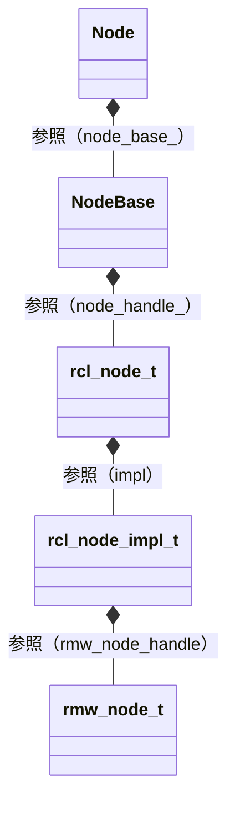

# 解説対象

:::message
この記事はROS初心者向けではなく、一通りの概念は理解したのでステップアップしたいという人向けです。本記事では、ROS2のNode実装のソースコードを読み込んだ内容をまとめています。自分でソースを読む際のガイドとして活用ください。
:::

## 読むと役に立つと思われる読者
- ROS2を使用したロボット開発を始めて数か月ぐらい、ROS2の主要な概念についてはおおざっぱには理解している人
- チュートリアル通りにやれば確かに動くけど・・・、自分は不適切な/冗長なコード書いているのでは？と自信がない方
- ROS2が期待通りに動いてくれない！という人

ROS2を用いた開発では、適切な設計や問題解決の為に遅かれ早かれソースを追って処理を確認する作業が必須になります。ある程度概念を掴めた後は、必要に感じたところからどんどんソースを読み始めましょう。

## ソースを見て理解するとよいポイント

- node名・node名前空間とremap処理のされ方
  - 大規模なロボットシステムを設計する場合には、nodeのfully qualified name（node名前空間とnode名を結合した名前）が衝突しないよう配慮が必要です。その際にremap処理がどう動いているのかをしっかり理解しておくと安心です。
  - 独自Nodeを設計する時に、Nodeパラメータの正しい理解は非常に重要です。特にlaunchファイルとNodeの間の処理のつながりが理解できると「ROSわかってきた感」が得られます


# 前提
- ROS2 humble時の実装に基づいています。
- c++側の実装（rclcppの[node.cpp](https://github.com/ros2/rclcpp/blob/rolling/rclcpp/src/rclcpp/node.cpp)）に基づいていますが、rclpy側も結局はrclで規定されるnode実装につながりますので、大部分は共通です。
- ノードには、ライフサイクルを持たないノード（rclcpp::Node）とライフサイクルを持つノード（rclcpp_lifecycle::LifecycleNode）の２種類がありますが、今回はライフサイクルを持たないノードの方です。

# 前提知識

ソースコードを読み始める前に下記は理解しておきましょう。
既に知っている方は読み飛ばし推奨。

## Nodeとは何か？（おさらい）
- Nodeは単なるクラスです。正確にはROS2上で実行する処理を記述する基本構成単位となるクラスです。初学者は勘違いしやすいですが、Nodeは実行可能なプログラム（=executable）ではなく、executable上で実行される処理の記述単位です。
- 通常、ROS2を用いたアプリケーションは非常に多数のNodeの連係動作によって実現します。
- Nodeは他のNodeと「トピック、サービス、アクション、ノードパラメータ」を通して通信（情報のやりとり）を行い連携動作できることが特徴です。
- あるNodeと別のNodeは同じプロセス上で実行することも、異なるプロセス上で実行することも、どちらも可能です
- Nodeは必ずexecutorを用いて資源（スレッド）が割り当てられ実行されます。明示的にexecutorを使っていないように見えても、裏で必ずexecutorが動いてます。executorはexecutable上で実行されます。

# 公式ドキュメント

Node周りを理解するのに参考となる公式ドキュメントはこのあたりですが・・・、これだけは深い理解はできません。

- 誰もが最初に読むところ
  - [Understanding-ROS2-Nodes](https://docs.ros.org/en/humble/Tutorials/Beginner-CLI-Tools/Understanding-ROS2-Nodes/Understanding-ROS2-Nodes.html)
  - プロンプトからのNodeの扱いはこれでわかりますね。でも実際にシステム開発していくには物足りないです。
- ここも読むの必須
  - [Composition](https://docs.ros.org/en/humble/Tutorials/Intermediate/Composition.html)
  - 実務的にはCompositionとても重要。でもここ読んだだけでは、〇〇どうなってるの？とたくさんの疑問が沸きます。
- APIリファレンス
  - [Node](http://docs.ros.org/en/humble/p/rclcpp/generated/classrclcpp_1_1Node.html#classrclcpp_1_1Node)
  - 不親切です。情報量が足りないです。

疑問が沸いたらソースを読むしかないです。

# ソースの確認

## Nodeの実装を理解する

まず、Nodeのprivateメンバを見てみましょう。たくさんの〇〇Interfaceへのスマートポインタが並んでいます。

[node.hpp](https://github.com/ros2/rclcpp/blob/humble/rclcpp/include/rclcpp/node.hpp)
```cpp:node.hpp抜粋
private:
  RCLCPP_DISABLE_COPY(Node)

  rclcpp::node_interfaces::NodeBaseInterface::SharedPtr node_base_;
  rclcpp::node_interfaces::NodeGraphInterface::SharedPtr node_graph_;
  rclcpp::node_interfaces::NodeLoggingInterface::SharedPtr node_logging_;
  rclcpp::node_interfaces::NodeTimersInterface::SharedPtr node_timers_;
  rclcpp::node_interfaces::NodeTopicsInterface::SharedPtr node_topics_;
  rclcpp::node_interfaces::NodeServicesInterface::SharedPtr node_services_;
  rclcpp::node_interfaces::NodeClockInterface::SharedPtr node_clock_;
  rclcpp::node_interfaces::NodeParametersInterface::SharedPtr node_parameters_;
  rclcpp::node_interfaces::NodeTimeSourceInterface::SharedPtr node_time_source_;
  rclcpp::node_interfaces::NodeWaitablesInterface::SharedPtr node_waitables_;

  const rclcpp::NodeOptions node_options_;
  const std::string sub_namespace_;
  const std::string effective_namespace_;
```

機能の実装が非常に整理されており分散して定義されてることがわかります。例えばNodeが他のNodeや外部のプログラムと連携する為のIFである
- topic通信
- サービス通信
- Nodeパラメータ
といった仕組みは、それぞれ別クラスで定義されています。

例えばNodeパラメータの仕組みは、rclcpp::node_interfaces::NodeParametersで実装されています。このクラスはrclcpp::node_interfaces::NodeParametersInterfaceをextendしており、Nodeのprivateメンバであるnode_parameters_から参照できるという構造です。

そしてprivateメンバは、Nodeをconstructした時に合わせて生成されます。

[node.cpp](https://github.com/ros2/rclcpp/blob/humble/rclcpp/src/rclcpp/node.cpp)
```cpp:node.cpp抜粋
Node::Node(
  const std::string & node_name,
  const std::string & namespace_,
  const NodeOptions & options)
: node_base_(new rclcpp::node_interfaces::NodeBase(
      node_name,
      namespace_,
      options.context(),
      *(options.get_rcl_node_options()),
      options.use_intra_process_comms(),
      options.enable_topic_statistics())),
  node_graph_(new rclcpp::node_interfaces::NodeGraph(node_base_.get())),
  node_logging_(new rclcpp::node_interfaces::NodeLogging(node_base_.get())),
  node_timers_(new rclcpp::node_interfaces::NodeTimers(node_base_.get())),
  node_topics_(new rclcpp::node_interfaces::NodeTopics(node_base_.get(), node_timers_.get())),
  node_services_(new rclcpp::node_interfaces::NodeServices(node_base_.get())),
  node_clock_(new rclcpp::node_interfaces::NodeClock(
      node_base_,
      node_topics_,
      node_graph_,
      node_services_,
      node_logging_
    )),
  node_parameters_(new rclcpp::node_interfaces::NodeParameters(
      node_base_,
      node_logging_,
      node_topics_,
      node_services_,
      node_clock_,
      options.parameter_overrides(),
      options.start_parameter_services(),
      options.start_parameter_event_publisher(),
      // This is needed in order to apply parameter overrides to the qos profile provided in
      // options.
      get_parameter_events_qos(*node_base_, options),
      options.parameter_event_publisher_options(),
      options.allow_undeclared_parameters(),
      options.automatically_declare_parameters_from_overrides()
    )),
  node_time_source_(new rclcpp::node_interfaces::NodeTimeSource(
      node_base_,
      node_topics_,
      node_graph_,
      node_services_,
      node_logging_,
      node_clock_,
      node_parameters_,
      options.clock_qos(),
      options.use_clock_thread()
    )),
  node_waitables_(new rclcpp::node_interfaces::NodeWaitables(node_base_.get())),
  node_options_(options),
  sub_namespace_(""),
  effective_namespace_(create_effective_namespace(this->get_namespace(), sub_namespace_))
{
```

そして、node_〇〇というメンバ変数（スマートポインタ）の参照先はconstruct時に確定しその後変わることはありません。Nodeと共に必ず１対１の関係で存在しますので、概念的にはNodeそのものと思ってよいです（機能を分割して定義しているだけ）

上記constructorを見てわかるのがnode_base_がかなり重要そうということ。node_〇〇を初期化するのに必ずnode_base_.get()が渡されています。

なので、まずはrclcpp::node_interfaces::NodeBaseを理解しましょう。

## NodeBaseの実装を理解する

[node_base.hpp](https://github.com/ros2/rclcpp/blob/humble/rclcpp/include/rclcpp/node_interfaces/node_base.hpp)

```cpp:node_base.hpp抜粋
private:
  RCLCPP_DISABLE_COPY(NodeBase)

  rclcpp::Context::SharedPtr context_;
  bool use_intra_process_default_;
  bool enable_topic_statistics_default_;

  std::shared_ptr<rcl_node_t> node_handle_;

  rclcpp::CallbackGroup::SharedPtr default_callback_group_;
  std::mutex callback_groups_mutex_;
  std::vector<rclcpp::CallbackGroup::WeakPtr> callback_groups_;

  std::atomic_bool associated_with_executor_;

  /// Guard condition for notifying the Executor of changes to this node.
  mutable std::recursive_mutex notify_guard_condition_mutex_;
  rclcpp::GuardCondition notify_guard_condition_;
  bool notify_guard_condition_is_valid_;
```

privateメンバの中で重要なのは、ずばり
```cpp
std::shared_ptr<rcl_node_t> node_handle_;
```
これはrcl_node_t型へのスマートポインタです。
node_handle_は、constructor中で作成されセットされます。

[node_base.cpp](https://github.com/ros2/rclcpp/blob/humble/rclcpp/src/rclcpp/node_interfaces/node_base.cpp)

```cpp:node_base.cpp抜粋
NodeBase::NodeBase(
  const std::string & node_name,
  const std::string & namespace_,
  rclcpp::Context::SharedPtr context,
  const rcl_node_options_t & rcl_node_options,
  bool use_intra_process_default,
  bool enable_topic_statistics_default)
: context_(context),
  use_intra_process_default_(use_intra_process_default),
  enable_topic_statistics_default_(enable_topic_statistics_default),
  node_handle_(nullptr),
  default_callback_group_(nullptr),
  associated_with_executor_(false),
  notify_guard_condition_(context),
  notify_guard_condition_is_valid_(false)
{
  // Create the rcl node and store it in a shared_ptr with a custom destructor.
  std::unique_ptr<rcl_node_t> rcl_node(new rcl_node_t(rcl_get_zero_initialized_node()));

  std::shared_ptr<std::recursive_mutex> logging_mutex = get_global_logging_mutex();

  rcl_ret_t ret;
  {
    std::lock_guard<std::recursive_mutex> guard(*logging_mutex);
    // TODO(ivanpauno): /rosout Qos should be reconfigurable.
    // TODO(ivanpauno): Instead of mutually excluding rcl_node_init with the global logger mutex,
    // rcl_logging_rosout_init_publisher_for_node could be decoupled from there and be called
    // here directly.
    ret = rcl_node_init(
      rcl_node.get(),
      node_name.c_str(), namespace_.c_str(),
      context_->get_rcl_context().get(), &rcl_node_options);
  }
  
  // 中略
  
  node_handle_.reset(
    rcl_node.release(),
    [logging_mutex](rcl_node_t * node) -> void {
      std::lock_guard<std::recursive_mutex> guard(*logging_mutex);
      // TODO(ivanpauno): Instead of mutually excluding rcl_node_fini with the global logger mutex,
      // rcl_logging_rosout_fini_publisher_for_node could be decoupled from there and be called
      // here directly.
      if (rcl_node_fini(node) != RCL_RET_OK) {
        RCUTILS_LOG_ERROR_NAMED(
          "rclcpp",
          "Error in destruction of rcl node handle: %s", rcl_get_error_string().str);
      }
      delete node;
    });  
```

上記の通り、new rcl_node_t()で作成された後にrcl_node_init()によってメンバ変数が設定された後に、node_handle_.reset()によってnode_handle_に参照が設定される。

なので次にrcl_node_tを見ていきましょう。

## rcl nodeの実装を理解する

ここからレポジトリが変わります。今まではrclcppレポジトリの中を見てきましたが、ここからはrclレポジトリになります。rcl nodeとは、クライアント言語（c++やpython）に依存しないノードの機能の共通実装部分であり、cで実装されています。

[node.h](https://github.com/ros2/rcl/blob/humble/rcl/include/rcl/node.h)

```c:node.h抜粋（構造体定義部分）
typedef struct rcl_node_impl_s rcl_node_impl_t;

/// Structure which encapsulates a ROS Node.
typedef struct rcl_node_s
{
  /// Context associated with this node.
  rcl_context_t * context;

  /// Private implementation pointer.
  rcl_node_impl_t * impl;
} rcl_node_t;
```
rcl_node_t構造体は上記の通りシンプルなstructです。見てわかるようにrcl_node_sはrcl_node_impl_tのラッパーであり、重要なのはrcl_node_impl_t構造体へのポインタimplです。

[node.c](https://github.com/ros2/rcl/blob/humble/rcl/src/node.c)

```c:node.c抜粋（構造体定義部分）
struct rcl_node_impl_s
{
  rcl_node_options_t options;
  rmw_node_t * rmw_node_handle;
  rcl_guard_condition_t * graph_guard_condition;
  const char * logger_name;
  const char * fq_name;
};
```

rcl_node_impl_s構造体で重要なのはrmw_node_t構造体へのポインタrmw_node_handleです。

## rmw nodeの実装を理解する
rmw nodeとは[RMW(Ros MiddleWare interface)](https://docs.ros.org/en/humble/p/rmw/generated/index.html)が提供するノード実装です。ノードがDDSという通信規格を用いてノード間で互いに通信を行えるようにしてくれています。

今まで見てきたレポジトリ（rclcpp,rcl）とはまた別のrmwレポジトリで管理されています。

[rmw/types.h](https://github.com/ros2/rmw/blob/humble/rmw/include/rmw/types.h)

```c:rmw/types.h抜粋（構造体定義部分）
/// Structure which encapsulates an rmw node
typedef struct RMW_PUBLIC_TYPE rmw_node_s
{
  /// Name of the rmw implementation
  const char * implementation_identifier;

  /// Type erased pointer to this node's data
  void * data;

  /// A concise name of this rmw node for identification
  const char * name;

  /// The namespace of this rmw node
  const char * namespace_;

  /// Context information about node's init specific information
  rmw_context_t * context;
} rmw_node_t;
```

Nodeの深堀はとりあえずここまで見れば十分です。

# まとめ

つまり、Nodeの基本構造（幹となる部分）は下記の図のようになります。
この幹の部分がわかっているとソースが非常に読みやすくなります。



NodeBaseより上はオブジェクト指向でコーディングされているが、rcl_node_t以下は関数ベースのコーディングなので注意（rcl以下は読みづらいです）

それぞれのざっくりとした役割は下記です。

- Nodeクラス
  - クライアント言語（c++）からnodeを操作する為のIFを提供する
  - nodeが持つ各種機能（トピック通信, サービス通信, Nodeパラメータ 等々）の実装はそれぞれ別クラスへ委譲しており、Nodeクラスはそれら機能を集約するクラスとなっている。
- NodeBaseクラス
  - クライアント言語（c++）からnodeを操作する為のIFを提供する
  - nodeが持つ各種機能の中でも、最も基本となる部分を実装。node名やnamespaceなどnodeを区別する為の値やnode間で通信する為の基礎実装をラップする。
- rcl_node_t構造体, rcl_node_impl_t構造体, 及びrcl_node_init等のrclの各種関数
  - クライアント言語（c++,python等）に依存しないnodeの基本機能を提供する。重要なのはrcl_node_init()関数であり、nodeを生成する処理としてnode名やnamesapaceのバリデーションやremap等の処理を行っている。
- rmw_node_t構造体及びrmwの各種関数
  - nodeがDDSという通信規格を用いて互いに通信を行えるようにする機能を提供
  - 
ここまでわかっていれば、個々の具体的な事情に応じて気になるところを読んでいくことになります。それらは別記事にします（順次追加予定）

https://zenn.dev/uedake/articles/ros2_node2_name
https://zenn.dev/uedake/articles/ros2_node3_remap